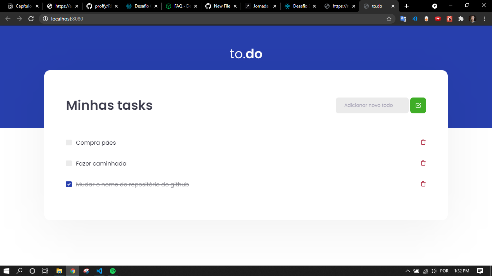

# Tasks Challenge

## :zap: Sobre
Esta aplicação é um desafio feito no programa Ignite da [Rocketseat](https://rocketseat.com.br/). O principal objetivo era completar algumas funcionalidades como adicionar tarefas, remover e marcar como concluido. Para mais informações segue o clique no [link](https://www.notion.so/Desafio-01-Conceitos-do-React-51e4099a6e2f4d4bae94f9fe75bb769d).

## :gear: Dependências
-  [Node.js](https://nodejs.org/en/)
-  [ReactJS](https://reactjs.org/)

## :rocket: Como executar

<pre><code>
  # Instalar dependências
  $ yarn # ou npm install
  # Executar em desenvolvimento
  $ yarn dev # ou npm run dev
</code></pre>

## :camera: Imagem

  

